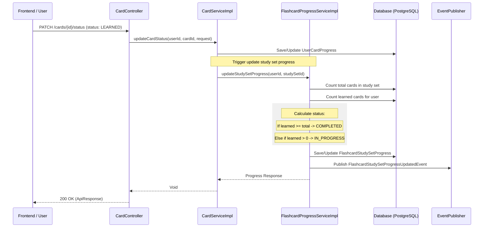

# Flashcard Progress Tracking Guide

Tài liệu này mô tả luồng hoạt động và các API sử dụng để theo dõi tiến độ học tập trong `repo-flashcard`, bao gồm việc đánh dấu thẻ (card) đã học và tự động tính toán trạng thái hoàn thành của học phần (study set).

## 1. Luồng hoạt động tổng quan

Hệ thống theo dõi tiến độ ở hai cấp độ:
1. **UserCardProgress**: Theo dõi trạng thái của từng thẻ đối với từng người dùng (ví dụ: `LEARNED`, `NOT_LEARNED`).
2. **FlashcardStudySetProgress**: Tổng hợp tiến độ của toàn bộ học phần dựa trên số lượng thẻ đã học. Trạng thái `COMPLETED` của học phần sẽ tự động được thiết lập khi người dùng học hết tất cả các thẻ trong học phần đó.

### Sơ đồ luồng (Mark Card Learned)



## 2. Danh sách API sử dụng

### 2.1 Đánh dấu thẻ đã học (Card Level)

Được sử dụng khi người dùng tương tác với card trong chế độ học (Flashcard, Quiz, v.v.)

- **Endpoint**: `PATCH /cards/{id}/status`
- **Authentication**: Yêu cầu JWT (Bearer Token)
- **Request Body**:
    ```json
    {
      "status": "LEARNED" 
    }
    ```
    *(Enum: `LEARNED`, `NOT_LEARNED`)*
- **Xử lý phía backend**:
    - Lưu trạng thái vào bảng `user_card_progress`.
    - Tự động gọi logic cập nhật `flashcard_study_set_progress`.

### 2.2 Lấy tiến độ học phần (Study Set Level)

Lấy thông tin tổng quát về tiến độ học của một user đối với một study set.

- **Endpoint**: `GET /study-sets/{studySetId}/progress`
- **Authentication**: Yêu cầu JWT (Bearer Token)
- **Response Body**:
    ```json
    {
      "id": "uuid",
      "userId": "uuid",
      "studySetId": "uuid",
      "status": "COMPLETED",
      "learnedCards": 20,
      "totalCards": 20,
      "progressPercentage": 100.0,
      "firstStartedAt": "2024-03-28T06:00:00Z",
      "completedAt": "2024-03-28T07:30:00Z"
    }
    ```
    *(Enum status: `NOT_STARTED`, `IN_PROGRESS`, `COMPLETED`)*

## 3. Logic Hoàn thành (Completion Logic)

Trạng thái `COMPLETED` của một Study Set **không được gọi trực tiếp qua API**. Thay vào đó, nó được tính toán tự động trong `FlashcardProgressServiceImpl.updateStudySetProgress`:

1. Đếm tổng số card trong study set (`totalCards`).
2. Đếm số card user đã đánh dấu là `LEARNED` (`learnedCards`).
3. So sánh:
    - Nếu `learnedCards >= totalCards`: Trạng thái = `COMPLETED`.
    - Ngược lại nếu `learnedCards > 0`: Trạng thái = `IN_PROGRESS`.
    - Ngược lại: Trạng thái = `NOT_STARTED`.
4. Khi trạng thái chuyển sang `COMPLETED`, trường `completedAt` sẽ được gán thời gian hiện tại.
5. Một sự kiện `FlashcardStudySetProgressUpdatedEvent` được phát ra để thông báo cho các dịch vụ khác (như `repo-video-course` để cập nhật tiến độ tổng thể của khóa học video).

## 4. Các file liên quan

- **Controller**: [CardController.java](file:///d:/DOANSP26/BACKEND/LMS_Backend/repo-flashcard/src/main/java/com/lms/flashcard/controller/CardController.java)
- **Service xử lý card**: [CardServiceImpl.java](file:///d:/DOANSP26/BACKEND/LMS_Backend/repo-flashcard/src/main/java/com/lms/flashcard/service/impl/CardServiceImpl.java)
- **Service xử lý tiến độ**: [FlashcardProgressServiceImpl.java](file:///d:/DOANSP26/BACKEND/LMS_Backend/repo-flashcard/src/main/java/com/lms/flashcard/service/impl/FlashcardProgressServiceImpl.java)
- **Entity**:
    - `UserCardProgress`
    - `FlashcardStudySetProgress`
